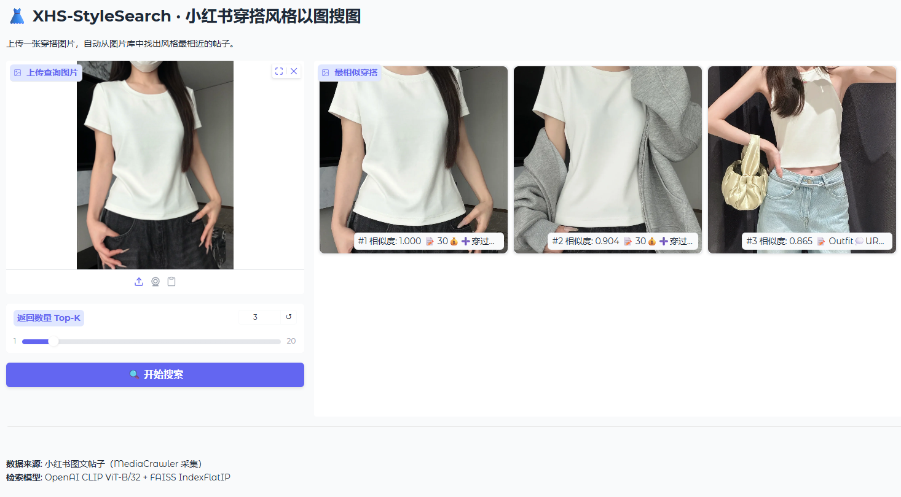

# 👗 XHS-StyleSearch

> 基于 [MediaCrawler](https://github.com/NanmiCoder/MediaCrawler) 采集的小红书图文数据，用 CLIP + FAISS 实现的穿搭风格以图搜图工具。一个小而好玩的多模态检索实验。

---

## 项目概要

输入任意一张穿搭图片，系统自动从本地图片库中找出风格最相近的小红书帖子，返回 Top-K 结果并展示帖子标题、博主信息和点赞数。

**技术栈**

- 数据采集：[MediaCrawler](https://github.com/NanmiCoder/MediaCrawler)
- 特征提取：OpenAI CLIP ViT-B/32
- 向量检索：FAISS IndexFlatIP（余弦相似度）
- Web Demo：Gradio

---

## 快速开始

### 1. 克隆项目

```bash
git clone https://github.com/your_username/XHS-StyleSearch.git
cd XHS-StyleSearch
```

### 2. 创建环境

```bash
conda create -n XHS-StyleSearch python=3.12 -y
conda activate XHS-StyleSearch
```

### 3. 安装依赖

```bash
pip install uv
uv pip install -r requirements.txt
```

### 4. 准备数据

先用 [MediaCrawler](https://github.com/NanmiCoder/MediaCrawler) 抓取小红书图文帖子，建议关键词：`穿搭, 休闲风, 慵懒风` 等，抓取数量不低于 1000 张图片。

抓完后将 MediaCrawler 的输出目录复制或软链接到本项目：

```
XHS-StyleSearch/
└── data/
    └── xhs/
        ├── images/          # MediaCrawler 下载的图片（按 note_id 分文件夹）
        └── jsonl/           # search_contents_*.jsonl 元数据文件
```

---

## 使用步骤

### Step 1：提取图片特征

```bash
python extract.py
```

遍历所有图片，使用 CLIP 提取 512 维语义特征向量，输出到 `xhs_stylesearch/data/`。

### Step 2：构建 FAISS 索引

```bash
python index.py
```

将特征向量写入 FAISS 索引库，保存为 `xhs.index`。

### Step 3：启动 Web Demo

```bash
python search.py
```

浏览器自动打开 `http://localhost:7860`，上传一张穿搭图片即可搜索。

---

## 效果示例



| 查询图片 | Top-3 检索结果 |
|---|---|
| 上传一张白色宽松卫衣 | 返回风格相近的慵懒穿搭帖子 |

---

## 声明

本项目在 [MediaCrawler](https://github.com/NanmiCoder/MediaCrawler) 的基础上开发，MediaCrawler 负责数据采集部分，本项目仅在其输出数据之上构建检索功能。使用本项目请遵守 MediaCrawler 的相关开源协议，数据仅供学习研究使用，请勿用于商业用途。

---

## License

MIT